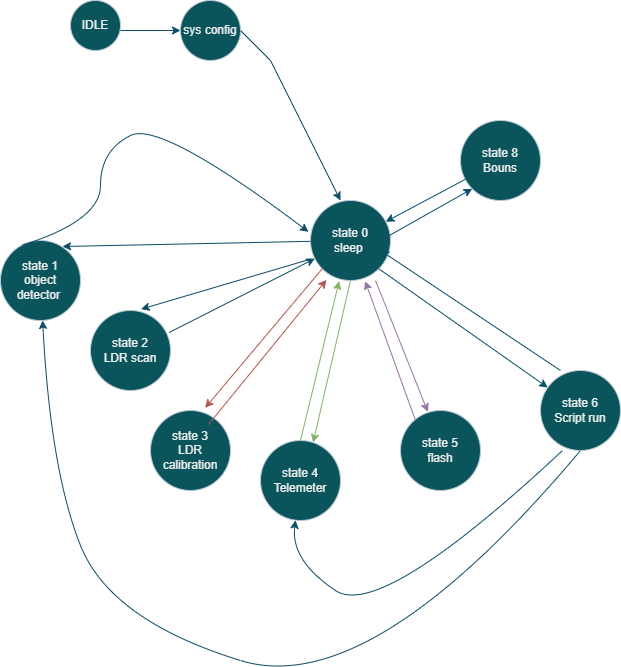

# DCSFinalProject
Final project in "Digital Computer Systems" course light source and object proximity detection 

an embedded project created using C and Python with Pygame

## System 
the MCU side in simple FSM:

## Demo

[![Watch the video] (https://www.youtube.com/watch?v=dkThi2uXjGU)

